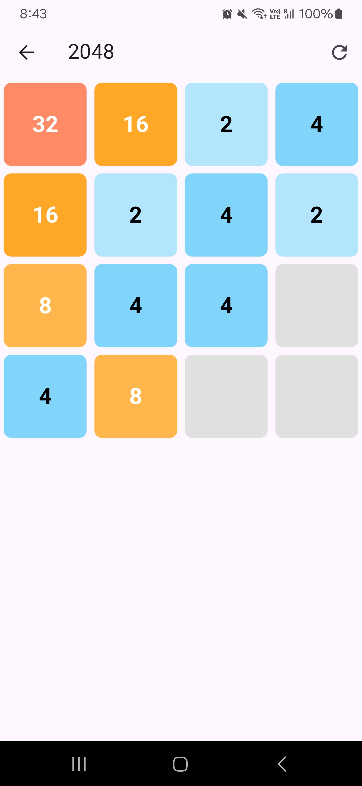

# Brain Games  
**Brain Games** is a Flutter-based app offering simple yet engaging games to challenge your mind. The app is currently under development, starting with **2048** and planning to include **Memory Match** and **Sudoku** in future updates.  

## Features  
- **2048**
- **Coming Soon**:  
  - Memory Match  
  - Sudoku
- **Stats Page**: Track your performance across games.  

  

## Installation  
1. Clone the repository:  
   ```bash
   git clone https://github.com/your-username/brain_games.git
   cd brain_games
   ```
2. Ensure Flutter is installed and set up.
3. Run the app:
    ```bash
    flutter run
    ```
    ```bash
    flutter run
    ```

## Build APK
```bash
flutter build apk --release
```

## Roadmap
1. Add Memory Match and sudoku.
1. Introduce a stats page.
1. Enhance UI/UX.

## License
This project is licensed under the MIT License.